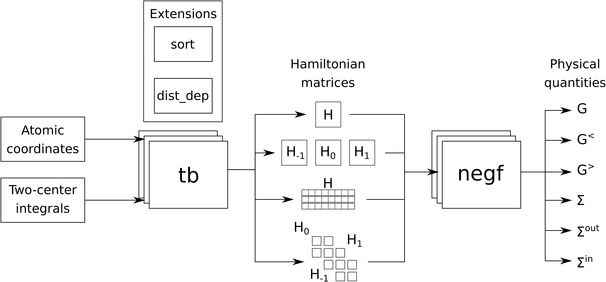

Packages and modules
====================

Softrware architecture
**********************

A generic control flow for applications developed with *Nanonet* is shown schematically in Fig. 1. The input parameters are the list of atomic coordinates and a table of two-center integrals. The framework contains two packages **tb** and **negf**. The package **tb** is the core responsible for composing and diagonalizing Hamiltonian matrices. The **negf** package processes TB matrices; it contains subroutines for computing Green's functions, namely implementing the Recursive Green's Function (RGF) algorithm.

    A generic control flow for applications developed with Nanonet.

**tb** represents a library of Python classes facilitating building Hamiltonian matrices, imposing periodic boundary conditions and computing electronic structure for molecules and solids using the TB method. The Hamiltonian matrices are built from an XYZ file containing atomic coordinates and a list of TB parameters. 

The software architecture relies on the object-oriented paradigms --- the framework represents a library of classes whose UML diagram is shown in Appendix. The central class of the framework is called **Hamiltonian** and contains all necessary information and functionality to construct Hamiltonian matrices that represents its main goal. This class inherits properties and member functions from classes **BasisTB** and **StructureDesignerXYZ** --- abstractions for basis sets and geometrical configuration of atoms correspondingly. The first one stores a look-up table that allows one to associate a set of orbitals with a label denoting a chemical element. The second one stores $kd$-tree built from the list of atomic coordinates.

The class **CyclicTopology** is used when periodic boundary conditions are applied. It translates atomic coordinates according to translation vectors and creates a kd-tree for atoms outside the primitive cell, needed to compute the Hamiltonian matrix responsible for coupling between neighbouring primitive cells.

The orbital sets are created using facilities of the class **Orbitals**. This class is the parent class for all basis sets. The current version of the software package contains predefined basis sets: sp3d5s* model for silicon, *SiliconSP3D5S*, single s-orbital for hydrogen, and sp3 model for bismuth. 

The version of the class **Hamiltonian** that uses sparse matrix representations is implemented in sub-class **HamiltonianSp** having same interface with some redefined member-functions.

The package **negf** is written in the procedural programming paradigm and contains functions that computes complex band structure, self-energies of leads and non-equilibrium Green's functions.

Package tb
**********

Module hamiltonian
------------------

.. automodule:: tb.hamiltonian
    :members:
    :private-members:
    :no-undoc-members:

Module hamiltonian_sparse
-------------------------

.. automodule:: tb.hamiltonian_sparse
    :members:
    :private-members:
    :no-undoc-members:

Module hamiltonian_initializer
------------------------------

.. automodule:: tb.hamiltonian_initializer
    :members:
    :private-members:
    :no-undoc-members:

Module structure_designer
-------------------------

.. automodule:: tb.structure_designer
    :members:
    :no-undoc-members:

Module orbitals
---------------

.. automodule:: tb.orbitals
    :members:
    :private-members:
    :no-undoc-members:

Module diatomic_matrix_element
------------------------------

.. automodule:: tb.diatomic_matrix_element
    :members:
    :private-members:
    :no-undoc-members:

Module block_tridiagonalization
-------------------------------

.. automodule:: tb.block_tridiagonalization
    :members:
    :private-members:
    :no-undoc-members:

Module sorting_algorithms
-------------------------

.. automodule:: tb.sorting_algorithms
    :members:
    :private-members:
    :no-undoc-members:

Package negf
************

Module greens_functions
-----------------------
.. automodule:: negf.greens_functions
    :members:
    :private-members:
    :no-undoc-members:

Module recursive_greens_functions
---------------------------------
.. automodule:: negf.recursive_greens_functions
    :members:
    :private-members:
    :no-undoc-members:
